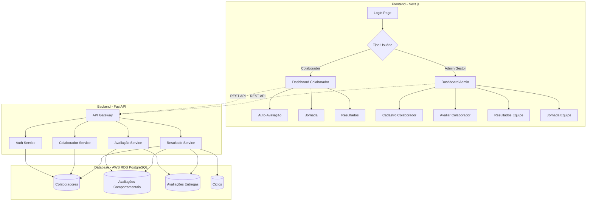

```mermaid
graph TB
subgraph "Frontend - Next.js"
A[Login Page] --> B{Tipo Usuário}
B -->|Colaborador| C[Dashboard Colaborador]
B -->|Admin/Gestor| D[Dashboard Admin]

        C --> C1[Auto-Avaliação]
        C --> C2[Jornada]
        C --> C3[Resultados]

        D --> D1[Cadastro Colaborador]
        D --> D2[Avaliar Colaborador]
        D --> D3[Resultados Equipe]
        D --> D4[Jornada Equipe]
    end

    subgraph "Backend - FastAPI"
        E[API Gateway]
        E --> F[Auth Service]
        E --> G[Colaborador Service]
        E --> H[Avaliação Service]
        E --> I[Resultado Service]
    end

    subgraph "Database - AWS RDS PostgreSQL"
        J[(Colaboradores)]
        K[(Avaliações Comportamentais)]
        L[(Avaliações Entregas)]
        M[(Ciclos)]
    end

    C -.->|REST API| E
    D -.->|REST API| E

    F --> J
    G --> J
    H --> K
    H --> L
    I --> J
    I --> K
    I --> L
    I --> M
```
